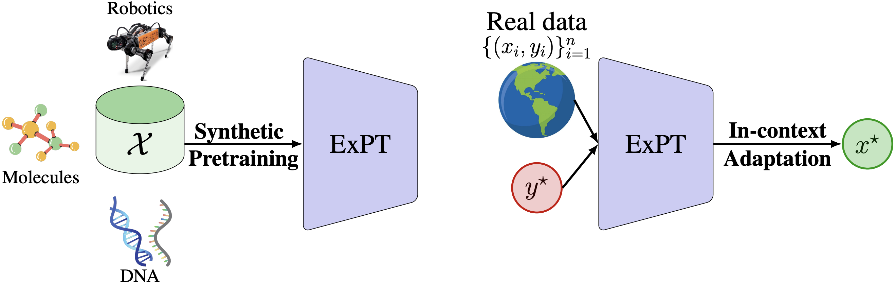

# ExPT: Synthetic Pretraining for Few-Shot Experimental Design

This is the official implementation of the paper [ExPT: Synthetic Pretraining for Few-Shot Experimental Design](http://arxiv.org/abs/2310.19961) in PyTorch. We propose Experiment Pretrained Transformer (ExPT), a novel method that can solve challenging experimental design problems with only a handful of labeled data points. During pretraining, we only assume knowledge of a finite collection of unlabelled data points from the input domain and train ExPT to optimize diverse synthetic functions defined over this domain. Unsupervised pretraining allows ExPT to adapt to any design task at test time in an in-context fashion by conditioning on a few labeled data points from the target task and generating the candidate optima. Please check out our project [website](https://sudhanshuagrawal27.github.io/ExPT/) and [blog post](https://medium.com/@sudhanshuagrawal2001/generative-ai-for-experimental-design-c25ee0c71e3f) for more details and discussions.



## Install

First, clone the repository:

```
git clone https://github.com/tung-nd/ExPT.git
```

Then install the dependencies as listed in `env.yml` and activate the environment:

```
conda env create -f env.yml
conda activate expt
```

## Pretraining

To pretrain ExPT for the Ant domain, run

```
CUDA_VISIBLE_DEVICES=0 python train_expt.py --config configs/pretrain_ant.yaml
```

Similar for dkitty (D'Kitty), tf8 (TF-Bind-8), and tf10 (TF-Bind-10). This code will pretrain ExPT with the default hyperparameters we used in the paper. Please check out the config file for more pretraining options.

## Adaptation

To evaluate a pretrained ExPT model, run

```
CUDA_VISIBLE_DEVICES=0 python eval_tnp_backward_from_gp.py \
    --config configs/pretrain_ant.yaml \
    --model.pretrained_path=PATH/TO/CHECKPOINT \
    --data.eval_data_ratio=0.01 \
    --data.eval_samping_strategy='random'
```

In which, `eval_data_ratio` denotes the ratio of labeled data points you use to condition the model, and `eval_samping_strategy` denotes the strategy for selecting these points, which can be either 'random' or 'poor' as defined in the paper.

## Citation

If you find this repo useful in your research, please consider citing our paper:
```
@article{nguyen2023expt,
  title={ExPT: Synthetic Pretraining for Few-Shot Experimental Design},
  author={Nguyen, Tung and Agrawal, Sudhanshu and Grover, Aditya},
  journal={arXiv preprint arXiv:2310.19961},
  year={2023}
}
```